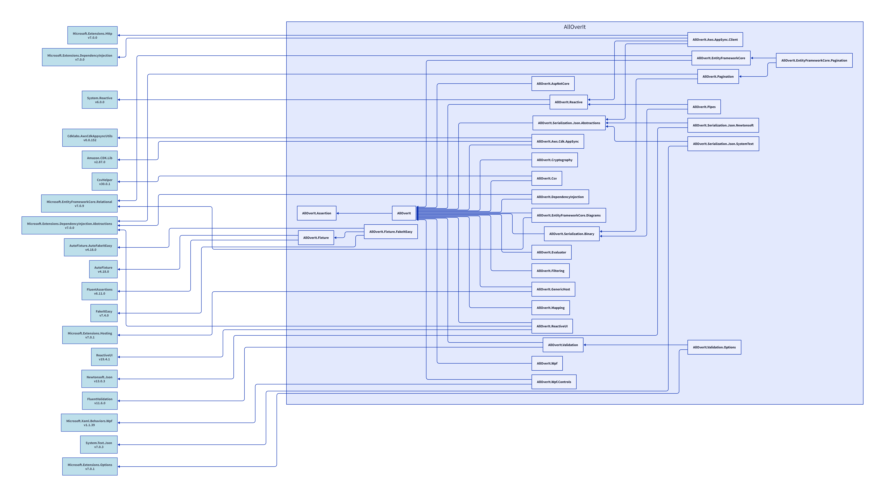

# Overview
**AllOverIt** began as a general purpose library in 2015 and has since evolved into a suite of libraries
aimed at providing a simplified and consistent approach to cross-cutting and functional concerns such as
caching, serialization, threading, reflection, conversions, mapping, event messaging, validation,
AWS AppSync, data (`IEnumable<T>` and `IQueryable<T>`) filtering and pagination, and much more.

The suite has an ever growing list of behavioural and functional unit tests. The coverage details can
be found below.

| Line Coverage                                     | Branch Coverage                                     | Method Coverage                                     |
| --------------------------------------------------|-----------------------------------------------------|---------------------------------------------------- |
|  |  |  |

Refer to this <a href="./Docs/Code%20Coverage/summary.html" target="_blank">link</a> or this
<a href="./Docs/Code%20Coverage/summary.md" target="_blank">markdown</a> for a summary of line and branch test code coverage.

# Packages
**AllOverIt** is a mono-repository. A summary for each of the available packages is provided below.

---

## AllOverIt

A general purpose library containing a variety of classes and helper utilities.

Refer to the online [Documentation](https://mjfreelancing.github.io/AllOverIt/) for usage information.

---

## AllOverIt.AspNetCore

A library containing ASP.NET Core utilities.

---

## AllOverIt.Assertion

A library containing pre and post condition assertion helper methods.

---

## AllOverIt.Aws.AppSync.Client

A library containing AppSync GraphQL and Subscription clients.

---

## AllOverIt.Aws.Cdk.AppSync

A library to help build AWS Graphql schemas using a code-first approach.

---

## AllOverIt.Csv

A library to assist with CSV export using CsvHelper.

---

## AllOverIt.DependencyInjection

A library containing useful dependency injection related utilities.

---

## AllOverIt.EntityFrameworkCore

A library providing utilities for use with EntityFramework Core.

---

## AllOverIt.EntityFrameworkCore.Diagrams

A library providing formatters to generate ERD diagrams using EntityFramework Core.

---

## AllOverIt.EntityFrameworkCore.Pagination

A library providing keyset-based pagination for use with EntityFramework Core.

---

## AllOverIt.Evaluator

A library containing an extendable expression compiler and evaluator.

---

## AllOverIt.Filtering

A library providing queryable filtering utilities.

---

## AllOverIt.Fixture

A library containing a base fixture class with numerous helper methods to assist with creating unit test scaffolding. Utilizes AutoFixture to do most of the hard work.

---

## AllOverIt.Fixture.FakeItEasy

A library extending **AllOverIt.Fixture** to support FakeItEasy integration.

---

## AllOverIt.GenericHost

A library containing a convenient wrapper for building console applications that support dependency injection.

---

## AllOverIt.Mapping

A library containing an object mapper that is mostly configuration free.

---

## AllOverIt.Pagination

A library providing queryable keyset-based pagination utilities.

---

## AllOverIt.Pipes

A library providing support for pipe based communication.

## AllOverIt.Reactive

A library containing utility extensions for use with System.Reactive.

---

## AllOverIt.ReactiveUI

A library containing utility extensions for use with ReactiveUI.

---

## AllOverIt.Serialization.Binary

A library providing support for binary serialization.

---

## AllOverIt.Serialization.Json.Abstractions

A library containing JSON serialization abstractions.

---

## AllOverIt.Serialization.Json.NewtonSoft

A library containing a wrapper for Newtonsoft.Json serialization based on AllOverIt.Serialization.Json.Abstractions.

---

## AllOverIt.Serialization.Json.SystemText

A library containing a wrapper for System.Text.Json serialization based on AllOverIt.Serialization.Json.Abstractions.

---

## AllOverIt.Validation

A library containing additional validators and extensions for use with FluentValidation.

---

## AllOverIt.Validation.Options

A library containing Options validation using FluentValidation.

---

## AllOverIt.Wpf

A library containing general purpose WPF utilities.

---

## AllOverIt.Wpf.Controls

A library containing useful WPF controls.

---

# Dependencies
The following diagram shows the explicit dependencies used across the entire AllOverIt suite.

